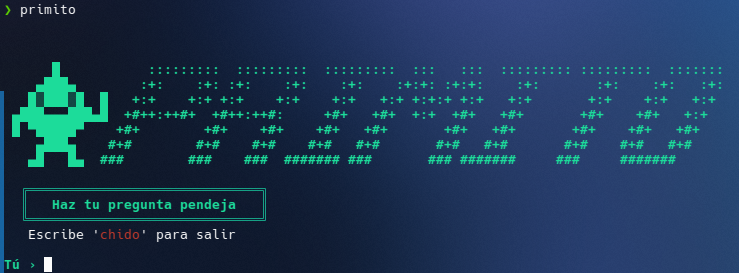

# primito
> **"Haz tu pregunta pendeja..."**

**Primito** es un asistente de terminal que rompe con la formalidad aburrida de las IAs convencionales. Desarrollado en Python con la **Gemini API**, está diseñado para responderte como un compa: directo, sin rodeos y cotorreando pero siempre dandote la respuesta que necesitas




## Requisitos

- Python 3
- Una API key de [Google AI Studio](https://aistudio.google.com) (gratis)

## Instalación
Corre el siguiente comando para comenzar a chatear con primito
```bash
git clone https://github.com/AxelDRV/primito.git && cd primito && ./instalar.sh
```

O manual:
```bash
git clone https://github.com/AxelDRV/primito.git
```
```bash
cd primito
```
```bash
./instalar.sh
```

## Configuración

Pon tu API key en `~/.primito.env`:
```
GEMINI_API_KEY=tu_api_key_aqui
```

## Uso
Escribe en tu terminal:
```bash
primito
```
y comienza a chatear con primito

Y escribe:
```bash
chido
```
cuando te hartes de hablar con él